

  

  
  
  

  <a href="#projects"></a>
  <a href="#stack"></a>
  <a href="#thesis">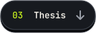</a>
  <a href="#certifications"></a>
  <a href="#stats">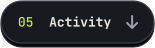</a>

 

I build web applications with a front-end bias: interfaces that feel fast and obvious, with a backend behind them that stays out of the way.

Computer Science graduate (GPA **3.63/4.00**) from Universitas 17 Agustus 1945 Surabaya. Most of my work lives in the **React / Next.js / TypeScript** world, with some Vue mixed in: an e-commerce platform with live payment integration, a job-application tracker live in production at trackinglamaran.site, a bill-splitting app with in-browser OCR live at splitbills.site, and a POS system built for a bakery client. Lately I take client products from a spec document to an approved, fully interactive demo: a Minecraft & Roblox asset marketplace, a car rental fleet system, a travel agency suite and a veterinary exam platform.

My thesis went a different direction: training CNN, LSTM, and BiLSTM models to read sentiment in Indonesian tweets about electric vehicles. The CNN + BiLSTM hybrid landed at **75% accuracy (macro F1 0.76)**, and I shipped it as a Streamlit app rather than leaving it in a notebook.

**Based in Indonesia · Open to remote front-end / full-stack roles**

<b>In a hurry? Open the 30-second version</b>

 

- **Role**: Front-end leaning full-stack developer, open to remote roles
- **Daily stack**: React, Next.js, TypeScript, Tailwind CSS, with Vue when the job calls for it
- **Back end**: Node.js, Express, Hono, Prisma, Drizzle, PostgreSQL, MariaDB
- **Live in production**: trackinglamaran.site · splitbills.site · fatihaljabar.com
- **Recent client work**: Blockwave Studios, NusaRide, Ramatama Tours, VetReady, Formkey
- **Thesis**: CNN + BiLSTM + Attention for Indonesian sentiment, 75% accuracy, macro F1 0.76
- **Education**: Computer Science, Universitas 17 Agustus 1945 Surabaya, GPA 3.63/4.00
- **Contact**: fatihaljabar@gmail.com

 

  

 

<picture>
  <source media="(prefers-color-scheme: dark)" srcset="assets/section-work-dark.svg">
  <source media="(prefers-color-scheme: light)" srcset="assets/section-work-light.svg">
  
</picture>

  <a href="https://blockwavestudio-demo.vercel.app">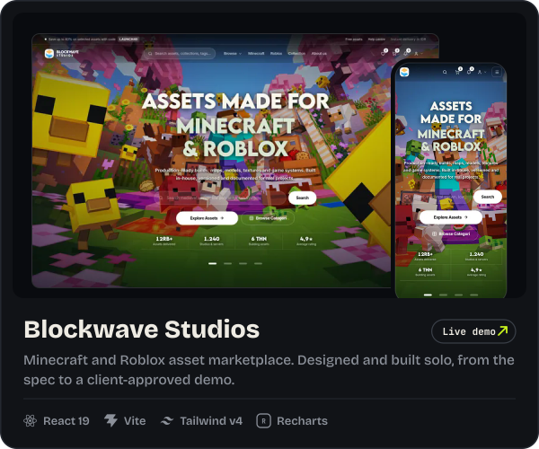</a>
  <a href="https://github.com/fatihaljabar/ottodot-trial-booking"></a>
  <a href="https://trackinglamaran.site">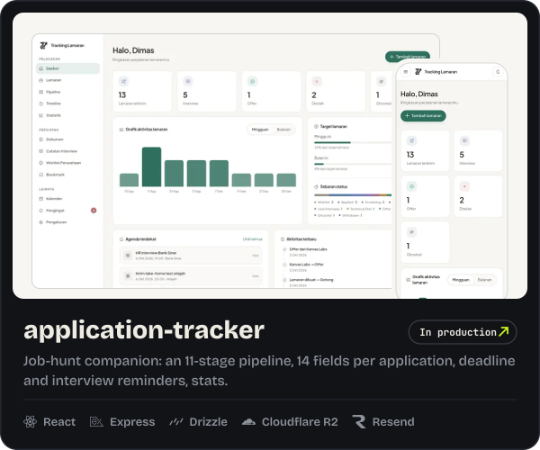</a>
  <a href="https://splitbills.site">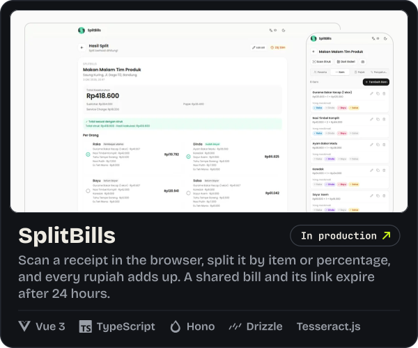</a>
  <a href="https://rentcar-demo-blue.vercel.app">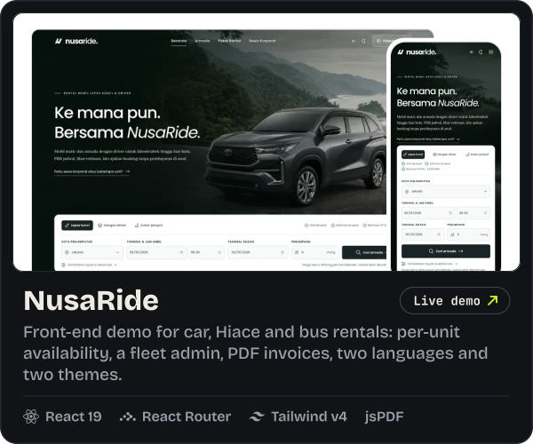</a>
  <a href="https://vetready-demo.vercel.app"></a>
  <a href="https://tours-agent-demo.vercel.app"></a>
  <a href="https://catalog-order-demo.vercel.app">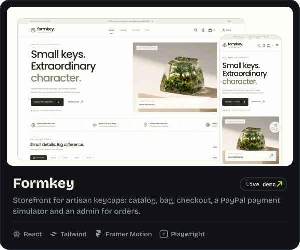</a>
  <a href="https://event-sport-demo.netlify.app">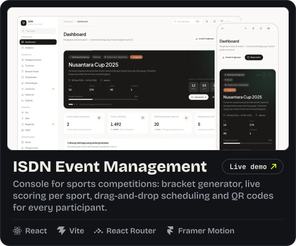</a>
  <a href="https://fatihaljabar.com">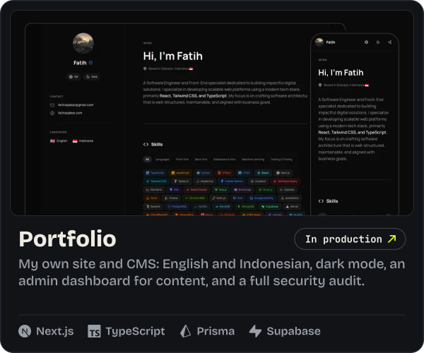</a>
  <a href="https://fadlanportfolio-demo.vercel.app">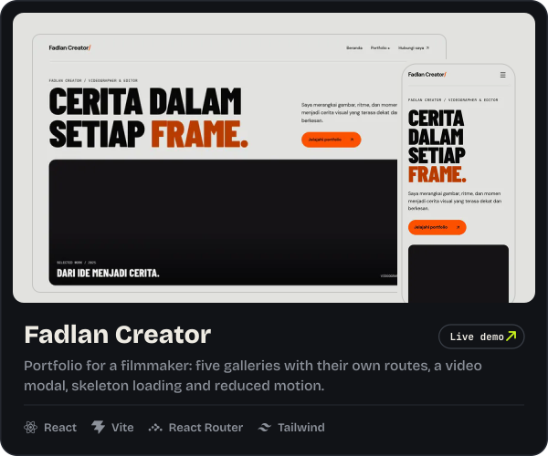</a>
  <a href="#spec-sheet"></a>

<b>Open the spec sheet</b>: every project with its full description, stack and links

 

| # | Project | What it does | Stack | Links |
|---|---|---|---|---|
| 01 | **Blockwave Studios** (private repo) | Digital asset marketplace for Minecraft and Roblox creators. Taken solo from a spec document to a client-approved, fully interactive demo: storefront, customer library and admin console with analytics, coupons and order states. The production build (Next.js 15 + NestJS, PostgreSQL, PayPal, Cloudflare R2) is in progress. | React 19 · Vite · React Router · Tailwind v4 · Framer Motion · Recharts | <a href="https://blockwavestudio-demo.vercel.app">Live demo</a> |
| 02 | **<a href="https://github.com/fatihaljabar/ottodot-trial-booking">ottodot-trial-booking</a>** | Full-stack take-home: trial classes capped at exactly 4 confirmed students. One PostgreSQL transaction with a class-row lock guards every path to a confirmed seat, idempotency keys make retries safe, and 34 automated tests cover it, including a genuinely concurrent last-seat race. | Next.js · TypeScript · PostgreSQL · Prisma · Zod · Vitest | <a href="https://github.com/fatihaljabar/ottodot-trial-booking">Repo</a> |
| 03 | **<a href="https://github.com/fatihaljabar/application-tracker">application-tracker</a>** | Job-hunt companion: 11-stage pipeline, 14-field tracking, deadline & interview reminders, document uploads, stats. **Live in production at trackinglamaran.site** | React · Vite · Express · Drizzle (MariaDB) · Cloudflare R2 · Resend | <a href="https://trackinglamaran.site">Live</a> · <a href="https://github.com/fatihaljabar/application-tracker">Repo</a> |
| 04 | **<a href="https://github.com/fatihaljabar/splitbill">splitbill</a>** | Bill-splitting app: in-browser OCR receipt scanning, flexible item/percentage splitting with exact-rupiah rounding, privacy-first short links. **Live in production at splitbills.site** | Vue 3 · TypeScript · Hono · Drizzle (MySQL) · Tesseract.js | <a href="https://splitbills.site">Live</a> · <a href="https://github.com/fatihaljabar/splitbill">Repo</a> |
| 05 | **<a href="https://github.com/fatihaljabar/rentcar-demo">NusaRide</a>** | Car, Hiace, Elf and bus rentals: self-drive, chauffeur and airport-transfer booking, per-unit availability, admin CRUD for fleet, drivers and payments, structured PDF invoices and reports, Indonesian/English and light/dark themes. | React 19 · TypeScript · Vite 7 · React Router · Tailwind v4 · Framer Motion · jsPDF | <a href="https://rentcar-demo-blue.vercel.app">Live demo</a> · <a href="https://github.com/fatihaljabar/rentcar-demo">Repo</a> |
| 06 | **<a href="https://github.com/fatihaljabar/vetready-demo">VetReady</a>** | Interactive demo for a veterinary exam prep platform: timed CBT simulation with flags and answer review, guided OSCE clinical scenarios, checkout with simulated payments, participant dashboard and admin portal. | React 19 · TypeScript · Vite 7 · Tailwind 4 · Framer Motion | <a href="https://vetready-demo.vercel.app">Live demo</a> · <a href="https://github.com/fatihaljabar/vetready-demo">Repo</a> |
| 07 | **Ramatama Tours** (private repo) | Travel agency management demo where quotation, booking, invoice, payment and receipt share one connected data model, with AR/AP, supplier bookings, itineraries, role-based access, multi-currency display and CSV export. | React · TypeScript · Vite · React Router · Tailwind · Framer Motion | <a href="https://tours-agent-demo.vercel.app">Live demo</a> |
| 08 | **Formkey** (private repo) | Storefront demo for artisan keycaps: catalog with search and sorting, bag and checkout, PayPal payment simulator, confirmation email preview, plus an admin for products, categories and orders. | React · TypeScript · Vite · Tailwind · Framer Motion · Playwright | <a href="https://catalog-order-demo.vercel.app">Live demo</a> |
| 09 | **event-sport-demo** (private repo) | ISDN event management demo: bracket generator, sport-specific live scoring engine (combat, race, judged, and more), drag-and-drop scheduling with conflict detection, QR check-in. Still in active development for a client. **Live demo at event-sport-demo.netlify.app** | React · Vite · React Router · Framer Motion | <a href="https://event-sport-demo.netlify.app">Live demo</a> |
| 10 | **<a href="https://github.com/fatihaljabar/portfolio">portfolio</a>** | Self-service CMS: bilingual EN/ID, dark mode, admin dashboard for content, whole-codebase security audit completed. **Live in production at fatihaljabar.com** | Next.js · TypeScript · Prisma · Supabase · next-intl | <a href="https://fatihaljabar.com">Live</a> · <a href="https://github.com/fatihaljabar/portfolio">Repo</a> |
| 11 | **Fadlan Creator** (private repo) | Cinematic portfolio for a videographer and filmmaker: five category galleries with their own routes, a demo video modal, skeleton loading states and reduced-motion support. | React · Vite · React Router · Tailwind | <a href="https://fadlanportfolio-demo.vercel.app">Live demo</a> |
| 12 | **sams-pos-demo** (private repo) | POS & inventory prototype for a bakery client: checkout, purchasing, production, multi-branch stock, audit logs | Next.js · TypeScript · Tailwind | Private |

 

<picture>
  <source media="(prefers-color-scheme: dark)" srcset="assets/section-stack-dark.svg">
  <source media="(prefers-color-scheme: light)" srcset="assets/section-stack-light.svg">
  
</picture>

  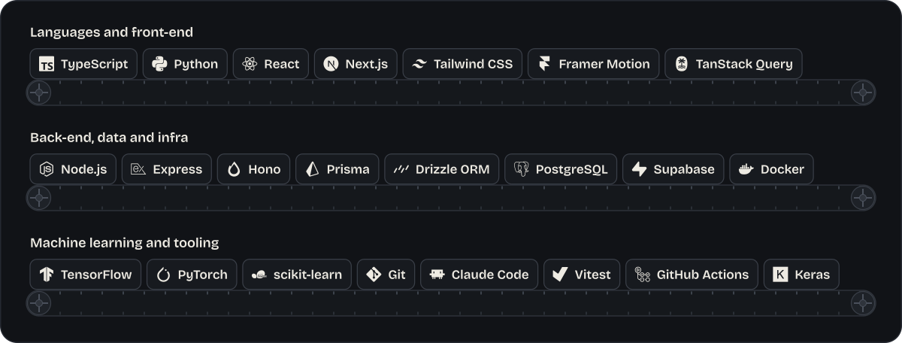

<b>Open the full toolbox</b> (73 tools, grouped)

 

**Languages** 

**Front-End** 

      

**Back-End** 

       

**Databases & Infra** 

   

**Machine Learning** 

   

**Testing & Tooling** 

  

 

<picture>
  <source media="(prefers-color-scheme: dark)" srcset="assets/section-thesis-dark.svg">
  <source media="(prefers-color-scheme: light)" srcset="assets/section-thesis-light.svg">
  
</picture>

  

**Sentiment Analysis on Online Reviews of Electric Vehicles Using Deep Learning**

Compared four architectures (CNN, LSTM, BiLSTM, and a CNN + BiLSTM hybrid with Attention) on Indonesian-language tweets (Jan 2023 to Aug 2025). Built the full Indonesian NLP pipeline: text cleaning, case folding, Sastrawi stemming, and lexicon-based quantile labeling. The hybrid model won at **75% accuracy / 0.76 macro F1**, and was deployed as a Streamlit app for real-time prediction.

  
  
  

 

<picture>
  <source media="(prefers-color-scheme: dark)" srcset="assets/section-certs-dark.svg">
  <source media="(prefers-color-scheme: light)" srcset="assets/section-certs-light.svg">
  
</picture>

Issued by <b>Dicoding Indonesia</b> unless noted.

- <a href="https://www.dicoding.com/certificates/N9ZOY1Y7DPG5">Becoming an Expert Front-End Web Developer</a>: PWA, accessibility, automation testing, CI/CD
- <a href="https://www.dicoding.com/certificates/EYX4J058OZDL">Front-End Web Development Fundamentals</a>: Web Components, module bundlers, async JS
- <a href="https://www.dicoding.com/certificates/EYX4J9RROZDL">Front-End Web Development for Beginners</a>: DOM manipulation, events, web storage
- <a href="https://www.dicoding.com/certificates/2VX349OGVZYQ">Back-End Fundamentals with JavaScript</a>: RESTful APIs, Node.js, Hapi, AWS EC2
- <a href="https://www.dicoding.com/certificates/NVP741O0WPR0">JavaScript Programming Basics</a>: OOP, functional programming, async
- <a href="https://www.dicoding.com/certificates/6RPNYN60QZ2M">Building a Career as a Software Developer</a>

 

<picture>
  <source media="(prefers-color-scheme: dark)" srcset="assets/section-stats-dark.svg">
  <source media="(prefers-color-scheme: light)" srcset="assets/section-stats-light.svg">
  
</picture>

  
  

 

  <a href="mailto:fatihaljabar@gmail.com"></a>

  
   
  <a href="#top">back to top</a> · every animation on this page is hand-written SVG and CSS, generated by <a href="scripts/build_assets.py">scripts/build_assets.py</a>

