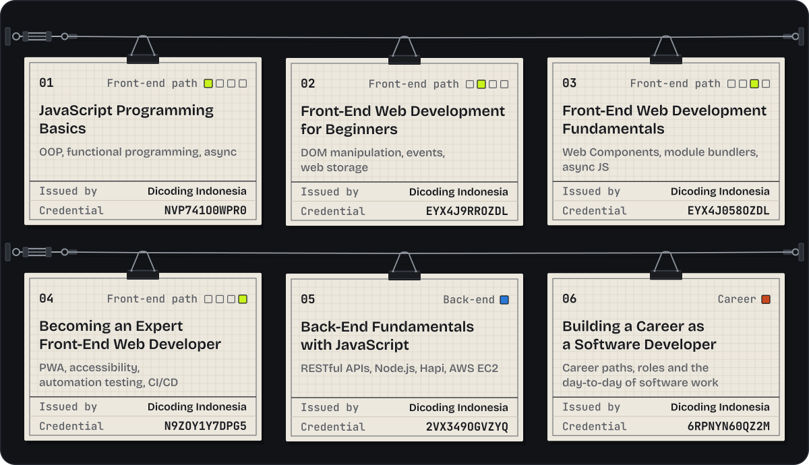

  

  <a href="https://www.linkedin.com/in/fatihaljabar"><picture><source media="(prefers-color-scheme: dark)" srcset="assets/btn-linkedin.svg"><source media="(prefers-color-scheme: light)" srcset="assets/btn-linkedin-light.svg"></picture></a>
  <a href="mailto:fatihaljabar@gmail.com"><picture><source media="(prefers-color-scheme: dark)" srcset="assets/btn-email.svg"><source media="(prefers-color-scheme: light)" srcset="assets/btn-email-light.svg"></picture></a>
  <a href="https://www.instagram.com/fatihaljabar"><picture><source media="(prefers-color-scheme: dark)" srcset="assets/btn-instagram.svg"><source media="(prefers-color-scheme: light)" srcset="assets/btn-instagram-light.svg"></picture></a>

  <a href="#projects"><picture><source media="(prefers-color-scheme: dark)" srcset="assets/btn-nav-work.svg"><source media="(prefers-color-scheme: light)" srcset="assets/btn-nav-work-light.svg"></picture></a>
  <a href="#stack"><picture><source media="(prefers-color-scheme: dark)" srcset="assets/btn-nav-stack.svg"><source media="(prefers-color-scheme: light)" srcset="assets/btn-nav-stack-light.svg"></picture></a>
  <a href="#thesis"><picture><source media="(prefers-color-scheme: dark)" srcset="assets/btn-nav-thesis.svg"><source media="(prefers-color-scheme: light)" srcset="assets/btn-nav-thesis-light.svg"></picture></a>
  <a href="#certifications"><picture><source media="(prefers-color-scheme: dark)" srcset="assets/btn-nav-certs.svg"><source media="(prefers-color-scheme: light)" srcset="assets/btn-nav-certs-light.svg"></picture></a>
  <a href="#activity"><picture><source media="(prefers-color-scheme: dark)" srcset="assets/btn-nav-stats.svg"><source media="(prefers-color-scheme: light)" srcset="assets/btn-nav-stats-light.svg"></picture></a>

  <a href="#activity"><picture><source media="(prefers-color-scheme: dark)" srcset="assets/stats.svg"><source media="(prefers-color-scheme: light)" srcset="assets/stats-light.svg"></picture></a>

I'm Fatih Al Jabar, a **Front-End & Full-Stack Developer** in Indonesia (UTC+7), and I take on freelance client projects. Send me your spec and I'll turn it into **a demo you can click through before any backend exists**, so you can try every screen and ask for changes while they're still easy to make. Once you approve it, I build the production version from it.

A Minecraft and Roblox asset marketplace, a travel agency suite, a vet exam platform and a sports event console all started that way. The marketplace is in its production build now.

My main stack is **React, Next.js and TypeScript**, with Node.js and PostgreSQL, MySQL or Supabase behind it, and Vue when a project calls for it. Three of my own apps run in production: a job-application tracker at [trackinglamaran.site](https://trackinglamaran.site), a bill splitter with in-browser receipt OCR at [splitbills.site](https://splitbills.site), and the site and CMS behind [fatihaljabar.com](https://fatihaljabar.com). I've also built an e-commerce platform with live payments, and with [Alief Adam](https://github.com/aliefadam) a POS for a bakery client.

If you have a spec that needs a first version, email me at [fatihaljabar@gmail.com](mailto:fatihaljabar@gmail.com) and tell me what you're building. I'll reply with how I'd approach it. The same address works if you're hiring for a front-end or full-stack role.

 

<h3><a href="#projects"><picture><source media="(prefers-color-scheme: dark)" srcset="assets/section-work.svg"><source media="(prefers-color-scheme: light)" srcset="assets/section-work-light.svg"></picture></a></h3>

  <a href="https://blockwavestudio-demo.vercel.app"><picture><source media="(prefers-color-scheme: dark)" srcset="assets/card-blockwave.svg"><source media="(prefers-color-scheme: light)" srcset="assets/card-blockwave-light.svg"></picture></a>
  <a href="https://github.com/fatihaljabar/ottodot-trial-booking"><picture><source media="(prefers-color-scheme: dark)" srcset="assets/card-ottodot.svg"><source media="(prefers-color-scheme: light)" srcset="assets/card-ottodot-light.svg"></picture></a>
  <a href="https://trackinglamaran.site"><picture><source media="(prefers-color-scheme: dark)" srcset="assets/card-tracker.svg"><source media="(prefers-color-scheme: light)" srcset="assets/card-tracker-light.svg"></picture></a>
  <a href="https://splitbills.site"><picture><source media="(prefers-color-scheme: dark)" srcset="assets/card-splitbill.svg"><source media="(prefers-color-scheme: light)" srcset="assets/card-splitbill-light.svg"></picture></a>
  <a href="https://rentcar-demo-blue.vercel.app"><picture><source media="(prefers-color-scheme: dark)" srcset="assets/card-nusaride.svg"><source media="(prefers-color-scheme: light)" srcset="assets/card-nusaride-light.svg"></picture></a>
  <a href="https://vetready-demo.vercel.app"><picture><source media="(prefers-color-scheme: dark)" srcset="assets/card-vetready.svg"><source media="(prefers-color-scheme: light)" srcset="assets/card-vetready-light.svg"></picture></a>
  <a href="https://tours-agent-demo.vercel.app"><picture><source media="(prefers-color-scheme: dark)" srcset="assets/card-ramatama.svg"><source media="(prefers-color-scheme: light)" srcset="assets/card-ramatama-light.svg"></picture></a>
  <a href="https://catalog-order-demo.vercel.app"><picture><source media="(prefers-color-scheme: dark)" srcset="assets/card-formkey.svg"><source media="(prefers-color-scheme: light)" srcset="assets/card-formkey-light.svg"></picture></a>
  <a href="https://event-sport-demo.netlify.app"><picture><source media="(prefers-color-scheme: dark)" srcset="assets/card-eventsport.svg"><source media="(prefers-color-scheme: light)" srcset="assets/card-eventsport-light.svg"></picture></a>
  <a href="https://fatihaljabar.com"><picture><source media="(prefers-color-scheme: dark)" srcset="assets/card-portfolio.svg"><source media="(prefers-color-scheme: light)" srcset="assets/card-portfolio-light.svg"></picture></a>
  <a href="https://sams-pos-demo.netlify.app"><picture><source media="(prefers-color-scheme: dark)" srcset="assets/card-samspos.svg"><source media="(prefers-color-scheme: light)" srcset="assets/card-samspos-light.svg"></picture></a>
  <a href="https://fadlanportfolio-demo.vercel.app"><picture><source media="(prefers-color-scheme: dark)" srcset="assets/card-fadlan.svg"><source media="(prefers-color-scheme: light)" srcset="assets/card-fadlan-light.svg"></picture></a>

<b>Open the spec sheet</b>: every project with the full description, stack and links

 

| # | Project | What it does | Stack | Links |
|---|---|---|---|---|
| 01 | **Blockwave Studios** private repo | Digital asset marketplace for Minecraft and Roblox creators. I designed and built it solo, from the client's spec to an approved, fully interactive demo: storefront, customer library and an admin console with analytics, coupons and order states. The production build (Next.js 15, NestJS, PostgreSQL, PayPal, Cloudflare R2) is in progress. | React 19, Vite, React Router, Tailwind v4, Framer Motion, Recharts | <a href="https://blockwavestudio-demo.vercel.app">Live demo</a> |
| 02 | **Ottodot Trial Booking** <a href="https://github.com/fatihaljabar/ottodot-trial-booking">ottodot-trial-booking</a> | Full-stack take-home: trial classes hold exactly four confirmed students. One PostgreSQL transaction with a class-row lock guards every path to a confirmed seat, idempotency keys make retries safe, and 34 automated tests cover it, including a genuinely concurrent last-seat race. | Next.js, TypeScript, PostgreSQL, Prisma, Zod, Vitest | <a href="https://github.com/fatihaljabar/ottodot-trial-booking">Repo</a> |
| 03 | **Tracking Lamaran** <a href="https://github.com/fatihaljabar/application-tracker">application-tracker</a> | Job-hunt companion: an 11-stage pipeline, 14 fields per application, deadline and interview reminders, document uploads and stats. | React, Vite, Express, Drizzle (MariaDB), Cloudflare R2, Resend | <a href="https://trackinglamaran.site">Live</a> / <a href="https://github.com/fatihaljabar/application-tracker">Repo</a> |
| 04 | **SplitBills** <a href="https://github.com/fatihaljabar/splitbill">splitbill</a> | Bill splitting with in-browser OCR receipt scanning, item or percentage splits with exact-rupiah rounding, a private mode where each person sees only their own share, and short links that expire after 24 hours. | Vue 3, TypeScript, Hono, Drizzle (MySQL), Tesseract.js | <a href="https://splitbills.site">Live</a> / <a href="https://github.com/fatihaljabar/splitbill">Repo</a> |
| 05 | **NusaRide** private repo | Front-end demo for car, Hiace, Elf and bus rentals: self-drive, chauffeur and airport-transfer booking, per-unit availability, admin CRUD for fleet, drivers and payments, PDF invoices and reports, Indonesian and English, light and dark. | React 19, TypeScript, Vite 7, React Router, Tailwind v4, Framer Motion, jsPDF | <a href="https://rentcar-demo-blue.vercel.app">Live demo</a> |
| 06 | **VetReady** private repo | Interactive demo for a veterinary exam prep platform: timed CBT simulation with flags and answer review, guided OSCE clinical cases, checkout with simulated payments, a participant dashboard and an admin portal. | React 19, TypeScript, Vite 7, Tailwind 4, Framer Motion | <a href="https://vetready-demo.vercel.app">Live demo</a> |
| 07 | **Ramatama Tours** private repo | Travel agency management demo where quotation, booking, invoice, payment and receipt share one connected data model, with AR and AP, supplier bookings, itineraries, role-based access, multi-currency display and CSV export. | React, TypeScript, Vite, React Router, Tailwind, Framer Motion | <a href="https://tours-agent-demo.vercel.app">Live demo</a> |
| 08 | **Formkey** private repo | Storefront demo for artisan keycaps: catalog with search and sorting, bag and checkout, a PayPal payment simulator, a confirmation email preview, and an admin for products, categories and orders. | React, TypeScript, Vite, Tailwind, Framer Motion, Playwright | <a href="https://catalog-order-demo.vercel.app">Live demo</a> |
| 09 | **ISDN Event Management** private repo | Event management console for ISDN sports competitions: bracket generator, sport-specific live scoring (combat, race, judged and more), drag-and-drop scheduling with conflict detection, and QR check-in. Still in active development for the client. | React, Vite, React Router, Framer Motion | <a href="https://event-sport-demo.netlify.app">Live demo</a> |
| 10 | **Portfolio** <a href="https://github.com/fatihaljabar/portfolio">portfolio</a> | My own site and self-service CMS: English and Indonesian, dark mode, an admin dashboard for content, and a full security audit of the codebase. | Next.js, TypeScript, Prisma, Supabase, next-intl | <a href="https://fatihaljabar.com">Live</a> / <a href="https://github.com/fatihaljabar/portfolio">Repo</a> |
| 11 | **POS** private repo | POS and inventory prototype for a bakery client, built with <a href="https://github.com/aliefadam">Alief Adam</a>: checkout, purchasing, production, stock across branches and audit logs. | Next.js, TypeScript, Tailwind | <a href="https://sams-pos-demo.netlify.app">Live demo</a> |
| 12 | **Fadlan Creator** private repo | Cinematic portfolio for a videographer and filmmaker: five category galleries with their own routes, a demo video modal, skeleton loading states and reduced-motion support. | React, Vite, React Router, Tailwind | <a href="https://fadlanportfolio-demo.vercel.app">Live demo</a> |

 

<h3><a href="#stack"><picture><source media="(prefers-color-scheme: dark)" srcset="assets/section-stack.svg"><source media="(prefers-color-scheme: light)" srcset="assets/section-stack-light.svg"></picture></a></h3>

  <a href="#stack"><picture><source media="(prefers-color-scheme: dark)" srcset="assets/stack.svg"><source media="(prefers-color-scheme: light)" srcset="assets/stack-light.svg"></picture></a>

<b>Open the full toolbox</b> (73 tools, grouped)

 

<picture><source media="(prefers-color-scheme: dark)" srcset="assets/toolbox.svg"><source media="(prefers-color-scheme: light)" srcset="assets/toolbox-light.svg"></picture>

 

<h3><a href="#thesis"><picture><source media="(prefers-color-scheme: dark)" srcset="assets/section-thesis.svg"><source media="(prefers-color-scheme: light)" srcset="assets/section-thesis-light.svg"></picture></a></h3>

  <a href="https://github.com/fatihaljabar/project-TA"><picture><source media="(prefers-color-scheme: dark)" srcset="assets/thesis.svg"><source media="(prefers-color-scheme: light)" srcset="assets/thesis-light.svg"></picture></a>

**Sentiment Analysis on Online Reviews of Electric Vehicles Using Deep Learning**

For my Computer Science degree at Universitas 17 Agustus 1945 Surabaya, I compared four architectures (CNN, LSTM, BiLSTM, and a CNN + BiLSTM hybrid with attention) on 26,852 Indonesian tweets collected from January 2023 to August 2025, and built the whole Indonesian NLP pipeline myself: text cleaning, case folding, Sastrawi stemming and lexicon-based quantile labeling. The hybrid won with **75.9% accuracy and 0.76 macro F1**. The repository has the notebook, the trained weights for all four models and a Streamlit app for trying sentiment predictions on your own text.

  <a href="https://project-ta-fatih.streamlit.app"><picture><source media="(prefers-color-scheme: dark)" srcset="assets/btn-demo.svg"><source media="(prefers-color-scheme: light)" srcset="assets/btn-demo-light.svg"></picture></a>
  <a href="https://github.com/fatihaljabar/project-TA"><picture><source media="(prefers-color-scheme: dark)" srcset="assets/btn-source.svg"><source media="(prefers-color-scheme: light)" srcset="assets/btn-source-light.svg"></picture></a>
  <a href="https://doi.org/10.36040/jati.v10i1.17094"><picture><source media="(prefers-color-scheme: dark)" srcset="assets/btn-article.svg"><source media="(prefers-color-scheme: light)" srcset="assets/btn-article-light.svg"></picture></a>

 

<h3><a href="#certifications"><picture><source media="(prefers-color-scheme: dark)" srcset="assets/section-certs.svg"><source media="(prefers-color-scheme: light)" srcset="assets/section-certs-light.svg"></picture></a></h3>

  <a href="#certifications"><picture><source media="(prefers-color-scheme: dark)" srcset="assets/certs.svg"><source media="(prefers-color-scheme: light)" srcset="assets/certs-light.svg"></picture></a>

All six are from **Dicoding Indonesia**, and each link opens the credential on dicoding.com: <a href="https://www.dicoding.com/certificates/NVP741O0WPR0">JavaScript Programming Basics</a>, <a href="https://www.dicoding.com/certificates/EYX4J9RROZDL">Front-End Web Development for Beginners</a>, <a href="https://www.dicoding.com/certificates/EYX4J058OZDL">Front-End Web Development Fundamentals</a>, <a href="https://www.dicoding.com/certificates/N9ZOY1Y7DPG5">Becoming an Expert Front-End Web Developer</a>, <a href="https://www.dicoding.com/certificates/2VX349OGVZYQ">Back-End Fundamentals with JavaScript</a> and <a href="https://www.dicoding.com/certificates/6RPNYN60QZ2M">Building a Career as a Software Developer</a>.

<b>The certificates as text</b>

 

| # | Course | What it covers | Credential |
|---|---|---|---|
| 01 | JavaScript Programming Basics | OOP, functional programming, async | <a href="https://www.dicoding.com/certificates/NVP741O0WPR0"><code>NVP741O0WPR0</code></a> |
| 02 | Front-End Web Development for Beginners | DOM manipulation, events, web storage | <a href="https://www.dicoding.com/certificates/EYX4J9RROZDL"><code>EYX4J9RROZDL</code></a> |
| 03 | Front-End Web Development Fundamentals | Web Components, module bundlers, async JS | <a href="https://www.dicoding.com/certificates/EYX4J058OZDL"><code>EYX4J058OZDL</code></a> |
| 04 | Becoming an Expert Front-End Web Developer | PWA, accessibility, automation testing, CI/CD | <a href="https://www.dicoding.com/certificates/N9ZOY1Y7DPG5"><code>N9ZOY1Y7DPG5</code></a> |
| 05 | Back-End Fundamentals with JavaScript | RESTful APIs, Node.js, Hapi, AWS EC2 | <a href="https://www.dicoding.com/certificates/2VX349OGVZYQ"><code>2VX349OGVZYQ</code></a> |
| 06 | Building a Career as a Software Developer |  | <a href="https://www.dicoding.com/certificates/6RPNYN60QZ2M"><code>6RPNYN60QZ2M</code></a> |

 

<h3><a href="#activity"><picture><source media="(prefers-color-scheme: dark)" srcset="assets/section-stats.svg"><source media="(prefers-color-scheme: light)" srcset="assets/section-stats-light.svg"></picture></a></h3>

  <a href="#activity"><picture><source media="(prefers-color-scheme: dark)" srcset="assets/activity.svg"><source media="(prefers-color-scheme: light)" srcset="assets/activity-light.svg"></picture></a>

<b>The numbers behind the chart</b>

 

Counted from the git history of 18 repositories, public and private, as of 4 October 2026: 594 commits in the last 52 weeks over 67 active days, longest streak 13 days.

| Month | Commits |
|---|---:|
| Oct 2025 | 0 |
| Nov 2025 | 0 |
| Dec 2025 | 7 |
| Jan 2026 | 3 |
| Feb 2026 | 82 |
| Mar 2026 | 106 |
| Apr 2026 | 51 |
| May 2026 | 0 |
| Jun 2026 | 0 |
| Jul 2026 | 4 |
| Aug 2026 | 288 |
| Sep 2026 | 53 |
| Oct 2026 | 0 |

| Repository | Commits |
|---|---:|
| sports-event-management-dashboard | 226 |
| portfolio | 148 |
| application-tracker | 103 |
| splitbill | 51 |
| fatihaljabar | 16 |
| ottodot-trial-booking | 12 |
| tours-agent-demo | 10 |
| project-ta | 7 |
| sams-pos-demo | 4 |
| rentcar-demo | 3 |
| flutter-app | 3 |
| vetready-demo | 2 |
| blockwavestudio-demo | 2 |
| blockwave-demo | 2 |
| event-sport-demo | 2 |
| blockwavestudio-dev | 1 |
| catalog-order-demo | 1 |
| fadlanportfolio-demo | 1 |

| Language | Lines | Share |
|---|---:|---:|
| TypeScript | 115,359 | 87.1% |
| CSS | 5,942 | 4.5% |
| Dart | 3,990 | 3.0% |
| Vue | 3,328 | 2.5% |
| Python | 2,175 | 1.6% |
| HTML | 830 | 0.6% |
| JavaScript | 522 | 0.4% |
| SQL | 301 | 0.2% |

 

  <a href="mailto:fatihaljabar@gmail.com"><picture><source media="(prefers-color-scheme: dark)" srcset="assets/footer.svg"><source media="(prefers-color-scheme: light)" srcset="assets/footer-light.svg"></picture></a>

  
   
  <a href="#top">Back to top</a>. Every drawing on this page is plain SVG and CSS, by <a href="https://github.com/fatihaljabar">fatihaljabar</a>.

